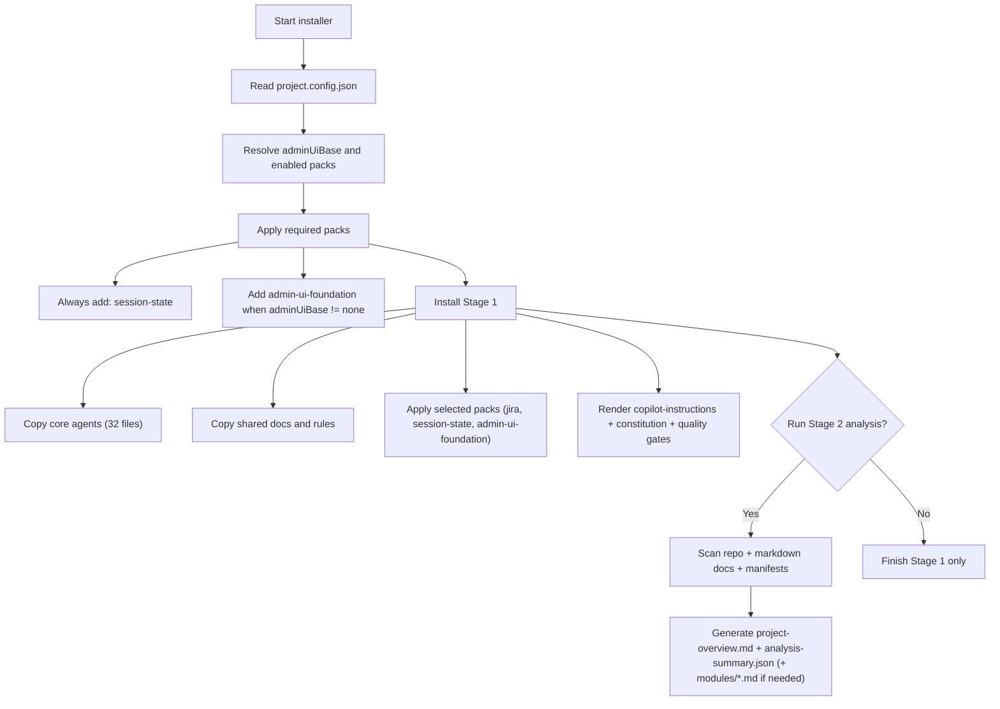
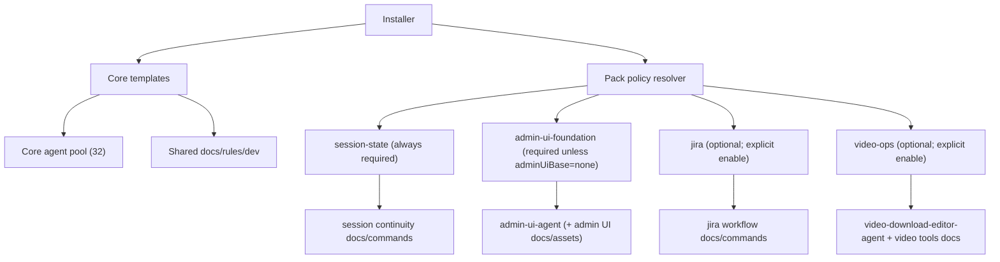

# Agent Orchestrator Installer

Russian version: [README.ru.md](./README.ru.md)

Cross-platform installer for agent orchestration templates and project analysis docs.

Roadmap (planned features and deferred integrations): [ROADMAP.md](./ROADMAP.md)

Skill pack specs (separate README per skill):
- [skill-security](./docs/skills/skill-security/README.md)
- [backup-recovery](./docs/skills/backup-recovery/README.md)
- [google-workspace-gog](./docs/skills/google-workspace-gog/README.md)
- [docker-essentials](./docs/skills/docker-essentials/README.md)
- [essence-distiller](./docs/skills/essence-distiller/README.md)
- [image-router](./docs/skills/image-router/README.md)
- [nano-banana-pro](./docs/skills/nano-banana-pro/README.md)
- [google-messages](./docs/skills/google-messages/README.md)
- [video-ops](./docs/skills/video-ops/README.md)

## Supported OS
- Windows (PowerShell)
- Linux
- macOS
- WSL

## What It Does
The tool supports two stages:
1. Install agent/rules infrastructure
2. Analyze an existing project and generate overview documentation

Admin panel baseline policy (default):
- `admin-ui-foundation` is enforced by default as required pack
- default `adminUiBase` is `admincore`
- explicit opt-out is possible only with `adminUiBase=none`

Session continuity policy (default):
- `session-state` is enforced by default as required pack
- intended for stable orchestrator progress and recovery after interruptions

## Installation And Dependency Map




Pack dependency rules:
- `session-state` is always installed.
- `admin-ui-foundation` is installed by default and skipped only when `adminUiBase=none`.
- `jira` is opt-in via `enabledPacks` or `--enable-pack jira`.
- `video-ops` is opt-in via `enabledPacks` or `--enable-pack video-ops`.
- Base core agents are always installed.

## Orchestrator Start (Copy/Paste)
Use this as a single starter command in your AI agent chat after installer setup:

```text
Work strictly as Orchestrator for this project. Read .ai/shared-docs/project-overview.md and all project *.md docs first. Delegate all implementation to subagents asynchronously (run_in_background=true), remain available in chat, provide short progress updates, and report each subagent result immediately. Never code directly as orchestrator. Follow git policy: always task branch -> PR -> merge to main, never direct push to main.
```

Recommended launch context:
- Open AI agent terminal in the target project root.
- Ensure `project-overview.md` exists (run stage-2 analysis if missing).
- Keep orchestrator mode strict: planning/delegation/verification only.

Mode presets (copy/paste variants): [ORCHESTRATOR-MODES.md](./templates/shared-docs/ORCHESTRATOR-MODES.md)

## Included Agent Packs (Current)
- Core engineering orchestration:
  - Orchestrator, SC, UI-UX, UI-Test, CR, DOMAIN, VALIDATION, DOC
- Product planning (optional stage):
  - Product-Manager, Sprint-Prioritizer, Feedback-Synthesizer
- Growth + Marketing:
  - Growth-Hacker, Content-Creator, SEO, Social-Media
  - AI-Citation, Agentic-Search-Optimizer
  - App-Store, Video-Optimization, LinkedIn, Twitter/X, Reddit
- Paid media:
  - Tracking-Measurement, PPC, Paid-Social, Ad-Creative
  - Paid-Media-Auditor, Search-Query-Analyst, Programmatic-Display-Buyer
- Multilingual localization:
  - Language-Translator-Agent (`EN/RU/HEB`)
- Admin UI foundation (optional pack):
  - Admin-UI-Agent
  - AdminCore rules + examples-first catalog workflow
- Video operations (optional pack):
  - Video-Download-Editor-Agent
  - yt-dlp/ffmpeg check scripts + download/edit recipes
  - Custom-project profile only (opt-in)

## Installation Flow
1. Read `project.config.json`
2. Validate required fields (`projectName`, `projectRoot`)
3. Resolve `codexHome` (`<projectRoot>/.ai` if not provided)
4. Copy templates:
   - `copilot-config/agents/*`
   - `shared-docs/dev/*`
   - `shared-docs/rules/*`
5. Render `copilot-config/copilot-instructions.md` with project tokens
6. Render policy docs:
   - `shared-docs/rules/CONSTITUTION.md`
   - `shared-docs/rules/QUALITY-GATES.md`
7. Prompt for second stage:
   - run project overview analysis now
   - if user answers `y/yes`, analysis runs immediately

## Analysis Flow
When analysis is enabled, the tool:
1. Scans repository structure (excluding `.git`, `node_modules`, `dist`, `build`, `.venv`, etc.)
2. Detects manifests/entry points (`package.json`, `pyproject.toml`, `go.mod`, `Cargo.toml`, `Dockerfile`, `docker-compose*`, `Makefile`, CI workflows)
3. Detects all directories containing `.md` files (existing docs intake)
4. Builds module sections:
   - Docs Intake
   - UI
   - Server/API
   - Services/Workers
   - Infra/CI
5. Extracts likely run/build/test commands
6. Produces risks, unknowns, and suggested agent profile
7. Generates one main file:
   - `shared-docs/project-overview.md`
8. Generates machine-readable summary:
   - `shared-docs/analysis-summary.json`
9. Splits large sections to:
   - `shared-docs/modules/docs.md`
   - `shared-docs/modules/ui.md`
   - `shared-docs/modules/server.md`
   - `shared-docs/modules/services.md`
   - `shared-docs/modules/infra.md`

## New/Empty Project Behavior
If a project is new and mostly empty:
- `project-overview.md` is still generated
- `New Project Bootstrap Notes` is added
- unknowns/risks are marked explicitly
- rerun analysis after first scaffold commit

## Admin UI ZIP Source Workflow
For convenience, Admin UI source can be provided as a zip archive instead of a local folder.

Resolution order:
1. `--admin-ui-source` (local folder path)
2. `--admin-ui-source-url` (http/https URL or local `.zip` path)

Archive mode behavior:
- downloads archive into cache (or uses local zip path)
- verifies checksum when `--admin-ui-sha256` is provided
- extracts archive to cache directory
- auto-detects source root containing `assets/css/theme.min.css`
- imports and sanitizes examples/assets for AdminCore usage

Production example (ready to use):
- URL: `https://github.com/ale4ko69/agent-orchestrator-installer/releases/download/admin-ui-v1.24.0-sanitized/admin-ui-v1.24.0-sanitized.zip`
- SHA256: `036238da45f8b9a9220cd40c7e54cf54d4210082628f25c47a2b8aaaf2cc1f4c`

## Flags
- `-DryRun / --dry-run`: preview changes without writing files
- `-UpdateOnly / --update-only`: update existing files only
- `-AnalyzeProject / --analyze-project`: run analysis + generate overview
- `-AnalyzeOnly / --analyze-only`: analysis only, skip template installation
- `-ModuleSplitThreshold / --module-split-threshold`: split threshold for module docs (default: `12`)
- `-AnalyzeProfile / --analyze-profile`: `auto|node|python|go|java|generic` (default: `auto`)
- `-NoSecondStepPrompt / --no-second-step-prompt`: skip stage-2 prompt after install
- `-EnablePack / --enable-pack`: packs, comma-separated (currently: `session-state`, `jira`, `admin-ui-foundation`, `video-ops`; `session-state` is always auto-enabled, `admin-ui-foundation` is auto-enabled unless `adminUiBase=none`)
- `-AdminUiBase / --admin-ui-base`: `admincore|custom|none` (default: `admincore`)
- `-AdminUiSource / --admin-ui-source`: optional local source path for importing admin UI examples/assets
- `--admin-ui-source-url`: optional URL/path to `.zip` archive with admin UI source snapshot
- `--admin-ui-sha256`: optional checksum verification for downloaded archive
- `--admin-ui-cache-dir`: optional cache directory for downloaded/extracted archive

## Optional Config Fields
In addition to required `projectName` and `projectRoot`, you can set:
- `authProvider`
- `complianceRequirements`
- `a11yLevel`
- `language`
- `framework`
- `database`
- `hosting`
- `sharedTypesPath`
- `enabledPacks` (array or comma-separated string, example: `["session-state","jira","admin-ui-foundation","video-ops"]`)
- `adminUiBase` (`admincore|custom|none`, default `admincore`; `none` disables default admin-ui-foundation enforcement)
- `adminUiSourcePath` (optional local path for importing examples/assets)
- `adminUiSourceUrl` (optional URL/path to `.zip` archive)
- `adminUiSourceSha256` (optional archive checksum)
- `adminUiCacheDir` (optional cache directory)

These values are injected into generated policy docs.

## Integrations Scope
- `Gastown` and `Beads` integrations are intentionally postponed for now.
- They are tracked in [ROADMAP.md](./ROADMAP.md) as opt-in future profiles.

## Help (Commands + Descriptions)
- Linux/macOS/WSL:
```bash
python3 scripts/install.py --help
```
- Windows PowerShell:
```powershell
Get-Help .\scripts\install.ps1 -Detailed
```

## Install From GitHub URL (Recommended Bootstrap)

Primary mode (no local installer git repo on your machine):
- download bootstrap entry script
- installer archive is downloaded to `<project>/.tmp/agent-installer`
- scripts run from that extracted copy
- no installer git clone is created in your workspace

### Windows
```powershell
$tmp = Join-Path $env:TEMP "bootstrap-remote.ps1"
Invoke-WebRequest https://raw.githubusercontent.com/ale4ko69/agent-orchestrator-installer/main/scripts/bootstrap-remote.ps1 -OutFile $tmp
pwsh -NoProfile -ExecutionPolicy Bypass -File $tmp
```

### Linux/macOS/WSL
```bash
tmp="/tmp/bootstrap-remote.sh"
curl -fsSL https://raw.githubusercontent.com/ale4ko69/agent-orchestrator-installer/main/scripts/bootstrap-remote.sh -o "$tmp"
bash "$tmp"
```

Bootstrap behavior:
1. Checks whether current folder looks like a project root.
2. Asks user to confirm using current folder.
3. If user declines (or folder is not a project), asks for project path.
4. Generates bootstrap config and runs the installer.

You can also pass project path explicitly:
- Windows: `pwsh -File $tmp -ProjectPath "D:\path\to\project"`
- Linux/macOS/WSL: `bash "$tmp" /path/to/project`

Optional (classic local mode, if you do want local clone of installer repo):
- clone this repo and run `scripts/bootstrap.ps1` or `scripts/bootstrap.sh`

## Usage
### Windows
```powershell
pwsh ./scripts/install.ps1 -ConfigPath ./project.config.json
pwsh ./scripts/install.ps1 -ConfigPath ./project.config.json -AnalyzeProject
pwsh ./scripts/install.ps1 -ConfigPath ./project.config.json -AnalyzeProject -EnablePack session-state
pwsh ./scripts/install.ps1 -ConfigPath ./project.config.json -AnalyzeProject -EnablePack session-state,jira
pwsh ./scripts/install.ps1 -ConfigPath ./project.config.json -AnalyzeProject -EnablePack video-ops
pwsh ./scripts/install.ps1 -ConfigPath ./project.config.json -AnalyzeProject -EnablePack admin-ui-foundation -AdminUiBase admincore -AdminUiSource "D:\Design\admin-ui-source\v1.24.0"
pwsh ./scripts/install.ps1 -ConfigPath ./project.config.json -AnalyzeProject -EnablePack admin-ui-foundation -AdminUiSourceUrl "https://example.com/admin-ui-v1.24.0.zip" -AdminUiSha256 "<sha256>"
pwsh ./scripts/install.ps1 -ConfigPath ./project.config.json -AnalyzeProject -AdminUiBase none
pwsh ./scripts/install.ps1 -ConfigPath ./project.config.json -AnalyzeProject -AnalyzeOnly
pwsh ./scripts/install.ps1 -ConfigPath ./project.config.json -AnalyzeProject -ModuleSplitThreshold 8
pwsh ./scripts/install.ps1 -ConfigPath ./project.config.json -AnalyzeProject -AnalyzeProfile node
pwsh ./scripts/install.ps1 -ConfigPath ./project.config.json -DryRun -AnalyzeProject
```

PowerShell may be restricted by execution policy. Without admin rights:
```powershell
pwsh -NoProfile -ExecutionPolicy Bypass -File .\scripts\install.ps1 -ConfigPath .\project.config.json -AnalyzeProject
```

No-PowerShell fallback (`cmd` + Python):
```bat
.\scripts\install.cmd .\project.config.json --analyze-project
```

### Linux/macOS/WSL
```bash
bash ./scripts/install.sh ./project.config.json
bash ./scripts/install.sh ./project.config.json --analyze-project
bash ./scripts/install.sh ./project.config.json --analyze-project --enable-pack session-state
bash ./scripts/install.sh ./project.config.json --analyze-project --enable-pack session-state,jira
bash ./scripts/install.sh ./project.config.json --analyze-project --enable-pack video-ops
bash ./scripts/install.sh ./project.config.json --analyze-project --enable-pack admin-ui-foundation --admin-ui-base admincore --admin-ui-source "/mnt/d/Design/admin-ui-source/v1.24.0"
bash ./scripts/install.sh ./project.config.json --analyze-project --enable-pack admin-ui-foundation --admin-ui-source-url "https://example.com/admin-ui-v1.24.0.zip" --admin-ui-sha256 "<sha256>"
bash ./scripts/install.sh ./project.config.json --analyze-project --admin-ui-base none
bash ./scripts/install.sh ./project.config.json --analyze-project --analyze-only
bash ./scripts/install.sh ./project.config.json --analyze-project --module-split-threshold 8
bash ./scripts/install.sh ./project.config.json --analyze-project --analyze-profile python
bash ./scripts/install.sh ./project.config.json --dry-run --analyze-project
```

## Do I Need Admin Rights?
Usually no. The scripts:
- read project files
- create/update files only inside `projectRoot/.ai` (or `codexHome`)
- do not install system packages or write system paths

Admin rights may be required only if your project is located in a protected OS directory.

## Generated Structure
```text
<project>/.ai/
  copilot-config/
    copilot-instructions.md
    agents/*.agent.md
  shared-docs/
    dev/*.md
    rules/*.md
    rules/CONSTITUTION.md
    rules/QUALITY-GATES.md
    ORCHESTRATOR-MODES.md
    QUICK-COMMANDS.md (when `session-state` pack is enabled)
    JIRA-WORKFLOW.md and QUICK-COMMANDS-JIRA.md (when `jira` pack is enabled)
    rules/ADMIN-UI-FOUNDATION.md (when `admin-ui-foundation` pack is enabled)
    tools/ADMINCORE-UI-KIT.md (when `admin-ui-foundation` pack is enabled)
    tools/ADMINCORE-COMPONENT-CATALOG.md (auto-generated when source path is provided)
    tools/VIDEO-DOWNLOAD-EDITING.md (when `video-ops` pack is enabled)
    tools/check-video-tools.ps1 and tools/check-video-tools.sh (when `video-ops` pack is enabled)
    assets/admincore/css/admincore-theme.min.css
    assets/admincore/examples/** (imported from source if provided)
    project-overview.md
    analysis-summary.json
    modules/*.md (optional, when sections are large)
```
