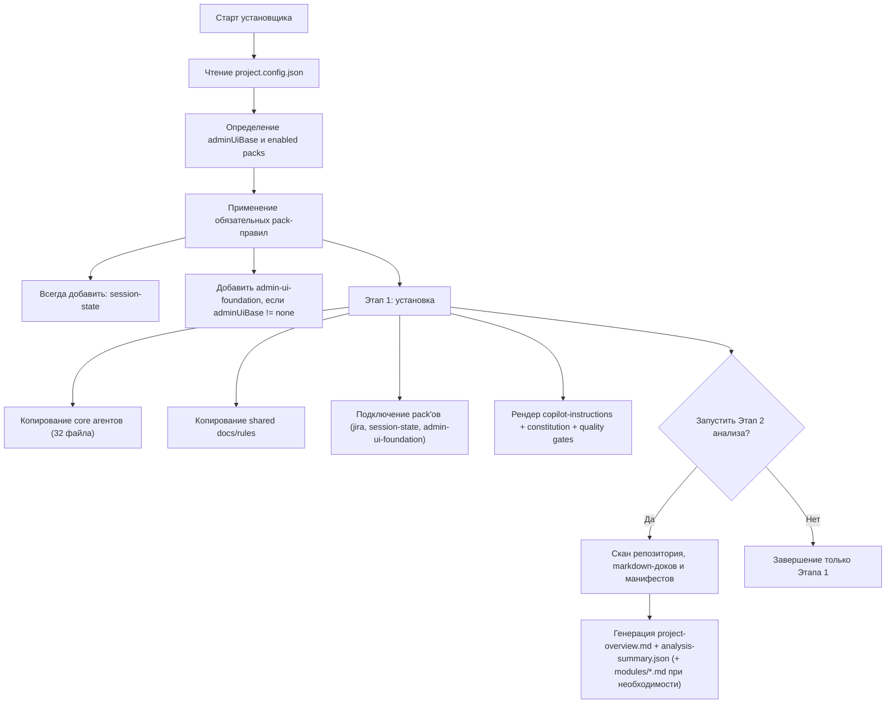
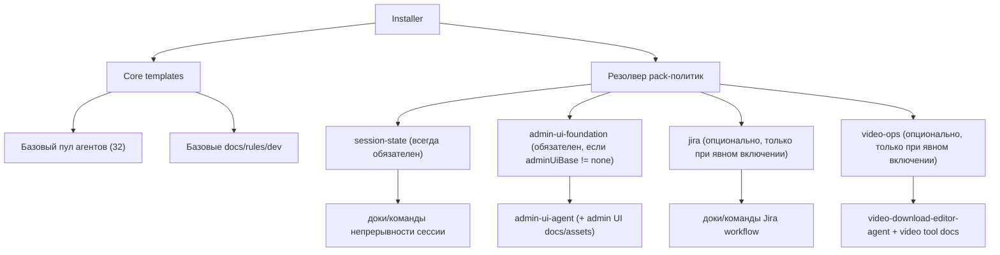

# Agent Orchestrator Installer

Установщик набора субагентов и общих правил оркестрации для любого проекта.

Roadmap: [ROADMAP.md](./ROADMAP.md)

Спецификации skill-паков (отдельный README на каждый skill):
- [skill-security](./docs/skills/skill-security/README.md)
- [backup-recovery](./docs/skills/backup-recovery/README.md)
- [google-workspace-gog](./docs/skills/google-workspace-gog/README.md)
- [docker-essentials](./docs/skills/docker-essentials/README.md)
- [essence-distiller](./docs/skills/essence-distiller/README.md)
- [image-router](./docs/skills/image-router/README.md)
- [nano-banana-pro](./docs/skills/nano-banana-pro/README.md)
- [google-messages](./docs/skills/google-messages/README.md)
- [video-ops](./docs/skills/video-ops/README.md)

## Поддерживаемые ОС
- Windows (PowerShell)
- Linux
- macOS
- WSL

## Что это делает
Скрипт может работать в двух режимах:
1. Установка инфраструктуры агентов и правил
2. Анализ проекта и генерация обзорной документации

Политика базы админки (по умолчанию):
- `admin-ui-foundation` подключается как обязательный pack по умолчанию
- базовый режим `adminUiBase` = `admincore`
- явное отключение возможно только через `adminUiBase=none`

Политика непрерывности сессии (по умолчанию):
- `session-state` подключается как обязательный pack по умолчанию
- нужен для стабильного прогресса оркестратора и восстановления после прерываний

## Карта Установки И Зависимостей




Правила зависимостей pack'ов:
- `session-state` ставится всегда.
- `admin-ui-foundation` ставится по умолчанию и отключается только через `adminUiBase=none`.
- `jira` включается только явно через `enabledPacks` или `--enable-pack jira`.
- `video-ops` включается только явно через `enabledPacks` или `--enable-pack video-ops`.
- Базовые core-агенты ставятся всегда.

## Старт Оркестратора (скопируй и вставь)
Используй эту одну команду в чате ИИ-агента после установки:

```text
Работай строго как Orchestrator для этого проекта. Сначала прочитай .ai/shared-docs/project-overview.md и все *.md в проекте. Все задачи реализации делегируй сабагентам асинхронно (run_in_background=true), оставайся доступным в диалоге, давай короткие статус-апдейты и сразу передавай результаты каждого сабагента. Никогда не пиши код напрямую как orchestrator. Соблюдай git-политику: всегда task-branch -> PR -> merge в main, прямой push в main запрещен.
```

Рекомендуемый контекст запуска:
- Открывай ИИ-агент терминал в корне целевого проекта.
- Убедись, что есть `project-overview.md` (если нет, запусти stage-2 анализ).
- Режим оркестратора должен быть строгим: только планирование/делегирование/верификация.

Пресеты режимов запуска (готовые варианты команд): [ORCHESTRATOR-MODES.md](./templates/shared-docs/ORCHESTRATOR-MODES.md)

## Какие наборы агентов входят сейчас
- Core-оркестрация разработки:
  - Orchestrator, SC, UI-UX, UI-Test, CR, DOMAIN, VALIDATION, DOC
- Продуктовый контур (опциональный этап):
  - Product-Manager, Sprint-Prioritizer, Feedback-Synthesizer
- Growth + Marketing:
  - Growth-Hacker, Content-Creator, SEO, Social-Media
  - AI-Citation, Agentic-Search-Optimizer
  - App-Store, Video-Optimization, LinkedIn, Twitter/X, Reddit
- Paid media:
  - Tracking-Measurement, PPC, Paid-Social, Ad-Creative
  - Paid-Media-Auditor, Search-Query-Analyst, Programmatic-Display-Buyer
- Мультиязычная локализация:
  - Language-Translator-Agent (`EN/RU/HEB`)
- База админ UI (optional pack):
  - Admin-UI-Agent
  - Правила AdminCore + workflow с каталогом примеров
- Видео workflow (optional pack):
  - Video-Download-Editor-Agent
  - Проверка yt-dlp/ffmpeg + готовые рецепты download/edit/convert
  - Только для custom media-проектов (opt-in)

## Полный флоу установки
1. Читает `project.config.json`
2. Проверяет `projectName` и `projectRoot`
3. Определяет `codexHome` (`<projectRoot>/.ai`, если не задан)
4. Копирует шаблоны:
   - `copilot-config/agents/*`
   - `shared-docs/dev/*`
   - `shared-docs/rules/*`
5. Рендерит `copilot-config/copilot-instructions.md` с токенами проекта
6. Рендерит policy-документы:
   - `shared-docs/rules/CONSTITUTION.md`
   - `shared-docs/rules/QUALITY-GATES.md`
7. Сразу спрашивает пользователя про второй шаг:
   - запустить обзорный анализ проекта прямо сейчас
   - при ответе `y/yes` сразу выполняет анализ и генерирует `project-overview.md`

## Полный флоу анализа
При флаге анализа скрипт:
1. Сканирует структуру репозитория (с исключениями: `.git`, `node_modules`, `dist`, `build`, `.venv`, и т.д.)
2. Ищет манифесты/entry points (`package.json`, `pyproject.toml`, `go.mod`, `Cargo.toml`, `Dockerfile`, `docker-compose*`, `Makefile`, CI workflows)
3. Ищет папки и файлы `.md` по всему проекту как источники существующей документации
4. Выделяет модульные зоны:
   - Docs Intake
   - UI
   - Server/API
   - Services/Workers
   - Infra/CI
5. Пытается извлечь команды запуска/сборки/тестов
6. Формирует риски, unknowns и suggested agent profile
7. Генерирует один главный файл:
   - `shared-docs/project-overview.md`
8. Генерирует машинно-читаемый summary:
   - `shared-docs/analysis-summary.json`
9. Если секция слишком большая, выносит детали в:
   - `shared-docs/modules/docs.md`
   - `shared-docs/modules/ui.md`
   - `shared-docs/modules/server.md`
   - `shared-docs/modules/services.md`
   - `shared-docs/modules/infra.md`
   и оставляет ссылки в главном файле

## Новый проект (пустой репозиторий)
Если проект новый и кода почти нет:
- `project-overview.md` всё равно создаётся
- добавляется блок `New Project Bootstrap Notes`
- unknowns и риски помечаются явно
- после первого scaffold-коммита можно перезапустить анализ

## ZIP Workflow Для Admin UI Source
Для удобства source админки можно передавать как `.zip` архив, а не только как локальную папку.

Порядок выбора источника:
1. `--admin-ui-source` (локальная папка)
2. `--admin-ui-source-url` (http/https URL или локальный путь к `.zip`)

Что делает архивный режим:
- скачивает архив в кэш (или использует локальный zip)
- проверяет checksum при передаче `--admin-ui-sha256`
- распаковывает архив в кэш
- автоопределяет корень source по `assets/css/theme.min.css`
- импортирует и санитизирует примеры/ассеты под AdminCore

## Режимы и флаги
- `-DryRun / --dry-run`: показать изменения без записи файлов
- `-UpdateOnly / --update-only`: обновлять только существующие файлы
- `-AnalyzeProject / --analyze-project`: запустить анализ и генерацию обзора
- `-AnalyzeOnly / --analyze-only`: только анализ, без установки шаблонов
- `-ModuleSplitThreshold / --module-split-threshold`: порог вынесения секции в отдельный модульный файл (default: 12)
- `-AnalyzeProfile / --analyze-profile`: профиль анализа `auto|node|python|go|java|generic` (default: `auto`)
- `-NoSecondStepPrompt / --no-second-step-prompt`: не спрашивать про второй шаг после установки
- `-EnablePack / --enable-pack`: подключить pack'и через запятую (сейчас: `session-state`, `jira`, `admin-ui-foundation`, `video-ops`; `session-state` подключается всегда автоматически, `admin-ui-foundation` подключается автоматически, если не задан `adminUiBase=none`)
- `-AdminUiBase / --admin-ui-base`: `admincore|custom|none` (по умолчанию: `admincore`)
- `-AdminUiSource / --admin-ui-source`: опциональный путь к локальному дизайн-источнику для импорта примеров/ассетов
- `--admin-ui-source-url`: опциональный URL/путь к `.zip` архиву со snapshot админки
- `--admin-ui-sha256`: опциональная проверка checksum архива
- `--admin-ui-cache-dir`: опциональная папка кэша для скачанного/распакованного архива

Дополнительные поля в `project.config.json` (опционально):
- `authProvider`
- `complianceRequirements`
- `a11yLevel`
- `language`
- `framework`
- `database`
- `hosting`
- `sharedTypesPath`
- `enabledPacks` (массив или строка через запятую, пример: `["session-state","jira","admin-ui-foundation","video-ops"]`)
- `adminUiBase` (`admincore|custom|none`, по умолчанию `admincore`; `none` отключает дефолтную привязку к admin-ui-foundation)
- `adminUiSourcePath` (опциональный локальный путь для импорта примеров/ассетов)
- `adminUiSourceUrl` (опциональный URL/путь к `.zip` архиву)
- `adminUiSourceSha256` (опциональная checksum архива)
- `adminUiCacheDir` (опциональная папка кэша)

## Help по флагам
- Linux/macOS/WSL:
```bash
python3 scripts/install.py --help
```
- Windows PowerShell:
```powershell
Get-Help .\scripts\install.ps1 -Detailed
```

## Установка по URL репозитория (рекомендуемый bootstrap)

Основной режим (без локального git-клона installer-репозитория):
- скачивается входной bootstrap-скрипт
- архив installer скачивается в `<project>/.tmp/agent-installer`
- установка запускается из распакованной копии
- отдельный локальный git-репозиторий installer не создаётся

### Windows
```powershell
$tmp = Join-Path $env:TEMP "bootstrap-remote.ps1"
Invoke-WebRequest https://raw.githubusercontent.com/ale4ko69/agent-orchestrator-installer/main/scripts/bootstrap-remote.ps1 -OutFile $tmp
pwsh -NoProfile -ExecutionPolicy Bypass -File $tmp
```

### Linux/macOS/WSL
```bash
tmp="/tmp/bootstrap-remote.sh"
curl -fsSL https://raw.githubusercontent.com/ale4ko69/agent-orchestrator-installer/main/scripts/bootstrap-remote.sh -o "$tmp"
bash "$tmp"
```

Поведение bootstrap:
1. Проверяет, похожа ли текущая папка на корень проекта.
2. Спрашивает подтверждение использовать текущую папку.
3. Если пользователь отказался (или папка не проектная), просит путь к проекту.
4. Генерирует bootstrap-конфиг и запускает установщик.

Можно явно передать путь проекта:
- Windows: `pwsh -File $tmp -ProjectPath "D:\path\to\project"`
- Linux/macOS/WSL: `bash "$tmp" /path/to/project`

Опционально (классический локальный режим):
- можно клонировать installer-репозиторий и запускать `scripts/bootstrap.ps1` / `scripts/bootstrap.sh`

Интеграции `Gastown/Beads` сейчас отложены и запланированы как будущие opt-in профили (см. roadmap).

## Запуск
### Windows
```powershell
pwsh ./scripts/install.ps1 -ConfigPath ./project.config.json
pwsh ./scripts/install.ps1 -ConfigPath ./project.config.json -AnalyzeProject
pwsh ./scripts/install.ps1 -ConfigPath ./project.config.json -AnalyzeProject -EnablePack session-state
pwsh ./scripts/install.ps1 -ConfigPath ./project.config.json -AnalyzeProject -EnablePack session-state,jira
pwsh ./scripts/install.ps1 -ConfigPath ./project.config.json -AnalyzeProject -EnablePack video-ops
pwsh ./scripts/install.ps1 -ConfigPath ./project.config.json -AnalyzeProject -EnablePack admin-ui-foundation -AdminUiBase admincore -AdminUiSource "D:\Design\admin-ui-source\v1.24.0"
pwsh ./scripts/install.ps1 -ConfigPath ./project.config.json -AnalyzeProject -EnablePack admin-ui-foundation -AdminUiSourceUrl "https://example.com/admin-ui-v1.24.0.zip" -AdminUiSha256 "<sha256>"
pwsh ./scripts/install.ps1 -ConfigPath ./project.config.json -AnalyzeProject -AdminUiBase none
pwsh ./scripts/install.ps1 -ConfigPath ./project.config.json -AnalyzeProject -AnalyzeOnly
pwsh ./scripts/install.ps1 -ConfigPath ./project.config.json -AnalyzeProject -ModuleSplitThreshold 8
pwsh ./scripts/install.ps1 -ConfigPath ./project.config.json -AnalyzeProject -AnalyzeProfile node
pwsh ./scripts/install.ps1 -ConfigPath ./project.config.json -DryRun -AnalyzeProject
```

PowerShell может быть ограничен Execution Policy. Без админ-прав используйте:
```powershell
pwsh -NoProfile -ExecutionPolicy Bypass -File .\scripts\install.ps1 -ConfigPath .\project.config.json -AnalyzeProject
```

Или вообще без PowerShell (через `cmd` + Python):
```bat
.\scripts\install.cmd .\project.config.json --analyze-project
```

### Linux/macOS/WSL
```bash
bash ./scripts/install.sh ./project.config.json
bash ./scripts/install.sh ./project.config.json --analyze-project
bash ./scripts/install.sh ./project.config.json --analyze-project --enable-pack session-state
bash ./scripts/install.sh ./project.config.json --analyze-project --enable-pack session-state,jira
bash ./scripts/install.sh ./project.config.json --analyze-project --enable-pack video-ops
bash ./scripts/install.sh ./project.config.json --analyze-project --enable-pack admin-ui-foundation --admin-ui-base admincore --admin-ui-source "/mnt/d/Design/admin-ui-source/v1.24.0"
bash ./scripts/install.sh ./project.config.json --analyze-project --enable-pack admin-ui-foundation --admin-ui-source-url "https://example.com/admin-ui-v1.24.0.zip" --admin-ui-sha256 "<sha256>"
bash ./scripts/install.sh ./project.config.json --analyze-project --admin-ui-base none
bash ./scripts/install.sh ./project.config.json --analyze-project --analyze-only
bash ./scripts/install.sh ./project.config.json --analyze-project --module-split-threshold 8
bash ./scripts/install.sh ./project.config.json --analyze-project --analyze-profile python
bash ./scripts/install.sh ./project.config.json --dry-run --analyze-project
```

## Нужны ли права администратора?
Обычно не нужны. Скрипты:
- читают файлы проекта
- создают/обновляют файлы только внутри целевого `projectRoot/.ai` (или `codexHome`)
- не ставят системные пакеты и не пишут в системные директории

Админ-доступ может понадобиться только если сам проект лежит в защищённой папке ОС.

## Что создаётся в целевом проекте
```text
<project>/.ai/
  copilot-config/
    copilot-instructions.md
    agents/*.agent.md
  shared-docs/
    dev/*.md
    rules/*.md
    rules/CONSTITUTION.md
    rules/QUALITY-GATES.md
    ORCHESTRATOR-MODES.md
    QUICK-COMMANDS.md (при включенном pack `session-state`)
    JIRA-WORKFLOW.md и QUICK-COMMANDS-JIRA.md (при включенном pack `jira`)
    rules/ADMIN-UI-FOUNDATION.md (при включенном pack `admin-ui-foundation`)
    tools/ADMINCORE-UI-KIT.md (при включенном pack `admin-ui-foundation`)
    tools/ADMINCORE-COMPONENT-CATALOG.md (генерируется при указании source path)
    tools/VIDEO-DOWNLOAD-EDITING.md (при включенном pack `video-ops`)
    tools/check-video-tools.ps1 и tools/check-video-tools.sh (при включенном pack `video-ops`)
    assets/admincore/css/admincore-theme.min.css
    assets/admincore/examples/** (импортируются из source path при наличии)
    project-overview.md
    analysis-summary.json
    modules/*.md (опционально, если секции большие)
```
