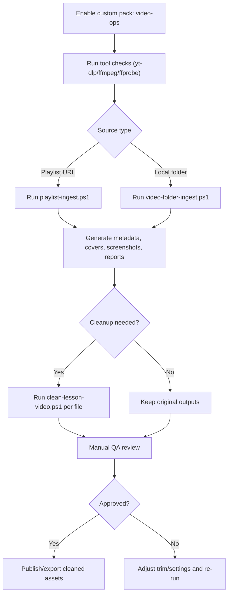

# Video Ops Custom Profile

Status: opt-in profile for custom projects only.

## When To Use
- Project includes media pipeline requirements:
  - playlist ingestion
  - batch video/audio download
  - clip extraction / format conversion
  - lesson cleanup for publishing
- Team has legal rights to process source media.
- `yt-dlp` and `ffmpeg` are available in environment.

## When Not To Use
- Standard web/backend app with no media processing needs.
- Environments without permission to download/process source media.
- Cases where no operator is available for final quality review.

## Required Tooling
- `yt-dlp`
- `ffmpeg`
- `ffprobe`

## Operating Model
1. Preflight checks
2. Source ingest (playlist or local folder)
3. Metadata + covers + screenshots generation
4. Optional cleanup/trim pass
5. Human review gate
6. Final export

## Workflow Map

## Safety Gates
- Never overwrite source media unless explicitly confirmed.
- Never run destructive bulk operations by default.
- Keep reports for every batch run:
  - playlist/folder report
  - cleanup report
- Final publish only after manual QA verdict.
